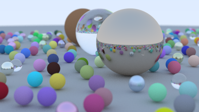

# Path Tracer
A path tracer simply follows the [Ray Tracing in One Weekend](https://raytracing.github.io/books/RayTracingInOneWeekend.html) guide.

## Features
- Unidirectional path tracing
- Antialiasing
- Importance sampling
- Diffuse, metal, dielectric material
- Defocus Blur
